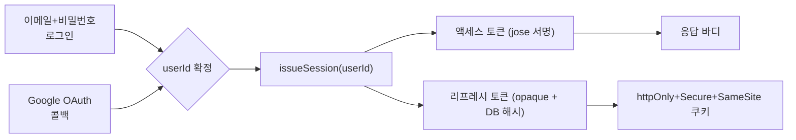
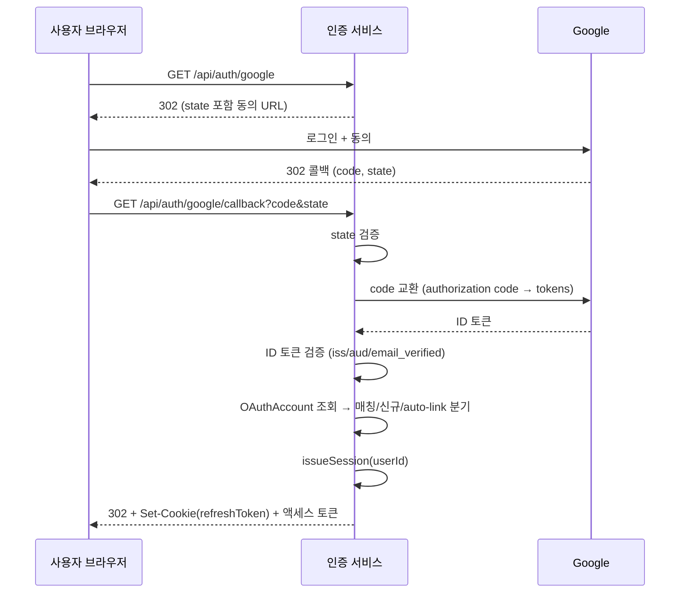

# Design: SPEC-AUTH-001 — 회원 가입·로그인 및 JWT 세션 관리

> JWT/OAuth 아키텍처, Prisma 스키마, 요청 흐름, threat model 요약. research.md(§1-§6)와 plan.md §3의 기술 접근을 아키텍처 문서로 정리한 것이며, 코드 구현 세부사항(함수 시그니처, 클래스 구조 등)은 다루지 않는다 — 그것은 run-phase의 몫이다.

## §1. 핵심 설계 원칙 — 공유 세션 발급 경로

이메일/비밀번호 로그인과 Google OAuth 로그인은 서로 다른 "정문(front door)"이지만, 확정된 `userId` 하나를 가지고 **동일한 세션 발급 함수**(`issueSession(userId)`)를 호출해 액세스+리프레시 토큰 쌍을 만든다. 이후의 미들웨어 검증/리프레시/로그아웃 로직은 진입 경로와 무관하게 완전히 동일하다.



## §2. Prisma 스키마 (개념 설계)

```
model User {
  id            String         @id @default(cuid())
  email         String         @unique
  passwordHash  String?        // nullable — OAuth 전용 사용자는 null
  emailVerified Boolean        @default(false)
  role          Role           @default(customer)
  createdAt     DateTime       @default(now())
  updatedAt     DateTime       @updatedAt
  oauthAccounts OAuthAccount[]
  refreshTokens RefreshToken[]
}

enum Role {
  customer
  admin
}

model OAuthAccount {
  id                String   @id @default(cuid())
  userId            String
  user              User     @relation(fields: [userId], references: [id], onDelete: Cascade)
  provider          String   // "google" (확장 가능)
  providerAccountId String   // Google의 sub
  createdAt         DateTime @default(now())

  @@unique([provider, providerAccountId])
}

model RefreshToken {
  id                String    @id @default(cuid())
  userId            String
  user              User      @relation(fields: [userId], references: [id], onDelete: Cascade)
  tokenHash         String
  familyId          String
  expiresAt         DateTime
  revokedAt         DateTime?
  replacedByTokenId String?
  userAgent         String?
  ip                String?
  createdAt         DateTime  @default(now())

  @@index([userId])
  @@index([tokenHash])
}
```

- `User`에는 Google 프로필의 locale/picture 등 UI가 실제로 쓰지 않는 필드는 저장하지 않는다(개인정보 최소 수집 원칙, `product.md` 핵심 제약).
- `OAuthAccount`에는 Google 자체의 access/refresh token은 저장하지 않는다.
- 이 3-테이블 구조가 `structure.md`의 `lib/auth/`·`lib/db/` 레이어링과 맞물린다.

## §3. 요청 흐름

### 3.1 이메일/비밀번호 로그인

```
POST /api/auth/login { email, password }
  → User 조회 (이메일로)
  → 존재하지 않으면: 더미 bcrypt 비교 수행 (타이밍 완화) → 401
  → 존재하면: bcrypt.compare(password, user.passwordHash)
    → 불일치: 401 (동일한 오류 메시지, 동일한 유사 응답 시간)
    → 일치: issueSession(user.id) → 액세스 토큰(바디) + 리프레시 토큰(쿠키)
```

### 3.2 리프레시 (로테이션)

```
POST /api/auth/refresh (Cookie: refreshToken=<opaque>)
  → tokenHash = hash(opaque)
  → RefreshToken 조회 (tokenHash로)
  → 없음: 401
  → revokedAt 존재 (이미 로테이션된 토큰의 재사용): familyId 전체 revoke → 401
  → expiresAt < now: 401 (신규 토큰 미발급)
  → 유효: 트랜잭션 시작
      1. 신규 RefreshToken 생성 (같은 familyId, replacedByTokenId 역참조)
      2. 기존 RefreshToken.revokedAt = now
      3. 신규 액세스 토큰 서명
    → 커밋 → 신규 액세스 토큰(바디) + 신규 리프레시 토큰(쿠키)
```

### 3.3 로그아웃

```
POST /api/auth/logout (Cookie: refreshToken=<opaque>)
  → tokenHash = hash(opaque)
  → RefreshToken.revokedAt = now (해당 토큰만 — 전체 기기 로그아웃은 Out of Scope)
  → Set-Cookie: refreshToken=; Max-Age=0
```

### 3.4 Google OAuth

```
GET /api/auth/google
  → OAuth2Client로 동의 URL 생성 (state 서명 포함, scope: openid,email,profile)
  → 302 리다이렉트

GET /api/auth/google/callback?code=...&state=...
  → state 검증 (세션 저장값과 비교) — 불일치: 400/401
  → code를 토큰으로 교환
  → ID 토큰 검증: 서명(JWKS), iss === https://accounts.google.com, aud === GOOGLE_CLIENT_ID, email_verified === true
    → 검증 실패: 로그인 거부, User/OAuthAccount 생성 없음
  → OAuthAccount(provider="google", providerAccountId=sub) 조회
    분기 A: 매칭 있음 → 해당 User로 issueSession(userId)
    분기 B: 매칭 없음 AND 동일 이메일의 기존 User 없음
            → 트랜잭션: User(passwordHash: null) 생성 + OAuthAccount 생성 → issueSession(userId)
    분기 C: 매칭 없음 AND 동일 이메일의 기존 User 있음 (email/password 계정)
            → ✅ auto-link (확정 정책, spec.md REQ-AUTH-019):
              트랜잭션: 기존 User에 OAuthAccount 자동 생성·연결 → issueSession(userId)
  → 세션 쿠키 설정 후 클라이언트로 리다이렉트
```



## §4. 신규 환경변수

| 변수 | 용도 |
|---|---|
| `JWT_ACCESS_SECRET` | 액세스 토큰 서명 키 |
| `JWT_ACCESS_TOKEN_EXPIRY` | 액세스 토큰 만료(기본 15분) |
| `JWT_REFRESH_TOKEN_EXPIRY` | 리프레시 토큰 만료(기본 30일) — 리프레시 토큰 자체는 opaque 값이므로 별도 서명 시크릿 불필요 |
| `GOOGLE_CLIENT_ID` / `GOOGLE_CLIENT_SECRET` | Google OAuth 클라이언트 자격 증명(서버 전용) |
| `GOOGLE_REDIRECT_URI` | OAuth 콜백 URI (환경별) |
| `COOKIE_DOMAIN` | 쿠키 도메인 (`NODE_ENV`에 따라 `Secure` 파생) |

> `tech.md`의 `NEXTAUTH_SECRET` 항목은 이번 SPEC에서 stale — sync-phase에서 위 변수명으로 교체 권장.

## §5. Threat Model 요약 (research.md §5 기반)

| # | 위협 | 완화책 |
|---|---|---|
| 1 | 알고리즘 혼동 공격 (`alg: none`) | 검증 시 알고리즘 화이트리스트 명시적 고정 |
| 2 | `exp`/`iss`/`aud` 검증 누락 | 발급 시 항상 설정, 검증 시 항상 확인 |
| 3 | 리프레시 토큰 재사용 | 로테이션 + family 전체 폐기 |
| 4 | 리프레시 토큰 탈취 (XSS) | httpOnly 쿠키 + DB 해시 저장(원문 미저장) |
| 5 | CSRF (쿠키 기반 refresh/logout) | SameSite + double-submit/synchronizer 토큰 |
| 6 | 브루트포스/크리덴셜 스터핑 | rate limiting(분당 5회, REQ-AUTH-021 확정 수치) + 소프트 락아웃(15분, 영구 금지) |
| 7 | 타이밍 공격 | 더미 bcrypt 비교로 응답 시간 균일화 |
| 8 | OAuth `state` CSRF | 서명/저장된 state 검증, 세션 CSRF와 독립 |
| 9 | Google ID 토큰 위조 | JWKS 서명 검증 + iss/aud/email_verified 확인 |
| 10 | 시크릿 노출 | 서버 전용 env var, `NEXT_PUBLIC_` 접두사 금지 |
| 11 | bcrypt 72바이트 절단 | 길이 제한 또는 SHA-256 사전 해시 |
| 12 | **auto-link 계정 탈취 (잔여 리스크, 수용)** | Google `email_verified === true`를 신뢰 근거로 채택. 이메일 우연 일치 + 실소유자 상이 시나리오는 발생 확률이 낮다고 판단해 수용(plan.md §5.1) — 향후 리스크 신호가 관측되면 explicit-confirm으로 전환 가능하도록 스키마/로직을 분리해 둔다. |
| 13 | 관리자(admin) 라우트 무단 접근 (REQ-AUTH-022, 신규 — 2026-08-26 사용자 확정 §5.5) | `src/middleware.ts`에서 `/admin` 하위 라우트 진입 시 세션의 `role` 클레임이 `admin`인지 확인하고, 아니면 리다이렉트 또는 403으로 거부한다. 액션 단위 세분화 권한(예: 상품 편집 vs 주문 취소 분리)은 이번 SPEC 범위 밖 — §3 Out of Scope 참고. |

## §6. 참고

- research.md — 근거 자료 및 출처
- plan.md §3 — 기술 접근 원본, §7 — Milestone 분해
- spec.md §2 — REQ-AUTH-001~025
- acceptance.md §6 — 보안 하드닝 AC
